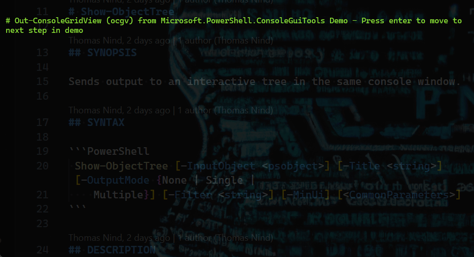

# GraphicalTools

The GraphicalTools repo contains `Microsoft.PowerShell.ConsoleGuiTools`: a
module that provides console-based GUI experiences based on
[Terminal.Gui (gui.cs)](https://github.com/migueldeicaza/gui.cs).

Note that a module named `Microsoft.PowerShell.GraphicalTools` used to be built
and published out of this repo, but per [#101](https://github.com/PowerShell/GraphicalTools/issues/101)
it is deprecated and unmaintained until such time that it can be rewritten on
top of [.NET MAUI](https://devblogs.microsoft.com/dotnet/introducing-net-multi-platform-app-ui/).

## Installation

```powershell
Install-Module Microsoft.PowerShell.ConsoleGuiTools
```

## Features

Cross-platform! Use the cmdlet
[`Out-ConsoleGridview`](docs/Microsoft.PowerShell.ConsoleGuiTools/Out-ConsoleGridView.md)
to view and filter objects graphically.



## Development

### 1. Install PowerShell 7.1+

Install PowerShell 7.1+ with [these instructions](https://github.com/PowerShell/PowerShell#get-powershell).

### 2. Clone the GitHub repository

```powershell
git clone https://github.com/PowerShell/GraphicalTools.git
```

### 3. Install [Invoke-Build](https://github.com/nightroman/Invoke-Build)

```powershell
Install-Module InvokeBuild -Scope CurrentUser
```

Now you're ready to build the code.  You can do so in one of two ways:

### 4. Building the code from PowerShell

```powershell
PS ./GraphicalTools> Invoke-Build Build -ModuleName Microsoft.PowerShell.ConsoleGuiTools
```

From there you can import the module that you just built for example:

```powershell
Import-Module ./module/Microsoft.PowerShell.ConsoleGuiTools
```

And then run the cmdlet you want to test, for example:

```powershell
Get-Process | Out-ConsoleGridView
```

> NOTE: If you change the code and rebuild the project, you'll need to launch a
> _new_ PowerShell process since the DLL is already loaded and can't be unloaded.

### 5. Debugging in Visual Studio Code

```powershell
PS ./GraphicalTools> code .
```

Build by hitting `Ctrl-Shift-B` in VS Code.

To debug:

In a PowerShell session in the `./GraphicalTools` directory, run `pwsh` (thus
nesting PowerShell).

Then do the folowing:

```powershell
Import-Module ./module/Microsoft.PowerShell.ConsoleGuiTools
$pid
```

This will import the latest built DLL and output the process ID you'll need
for debugging. Copy this ID to the clipboard.

In VScode, set your breakpoints, etc. Then hit `F5`. In the VScode search
box, paste the value printed by `$pid`. You'll see something like `pwsh.exe
18328`. Click that and the debug session will start.

In the PowerShell session run your commands; breakpoints will be hit, etc.

When done, run `exit` to exit the nested PowerShell and run `pwsh` again.
This unloads the DLL.  Repeat.

## Contributions Welcome

We would love to incorporate community contributions into this project.  If
you would like to contribute code, documentation, tests, or bug reports,
please read the [development section above](https://github.com/PowerShell/GraphicalTools#development)
to learn more.

## (Deprecated) Microsoft.PowerShell.GraphicalTools Architecture

Due to the quirks of the PowerShell threading implementation, the design of
GUIs in this application are non-standard. The cmdlet invokes an Avalonia
application as a separate process to guarantee the GUI is running on the main
thread. Graphical tools therefore consists of 3 .NET Projects.

- Microsoft.PowerShell.GraphicalTools - Cmdlet implementations
- OutGridView.Gui - Implementation of the Out-GridView window
- OutGridView.Models - Contains data contracts between the GUI & Cmdlet

## Maintainers

- [Andrew Schwartzmeyer](https://andschwa.com) - [@andschwa](https://github.com/andschwa)

Originally authored by [Tyler Leonhardt](http://twitter.com/tylerleonhardt).

## License

This project is [licensed under the MIT License](LICENSE).

## [Code of Conduct][conduct-md]

This project has adopted the [Microsoft Open Source Code of Conduct][conduct-code].
For more information see the [Code of Conduct FAQ][conduct-FAQ] or contact [opencode@microsoft.com][conduct-email] with any additional questions or comments.

[conduct-code]: https://opensource.microsoft.com/codeofconduct/
[conduct-FAQ]: https://opensource.microsoft.com/codeofconduct/faq/
[conduct-email]: mailto:opencode@microsoft.com
[conduct-md]: https://github.com/PowerShell/GraphicalTools/tree/master/CODE_OF_CONDUCT.md
